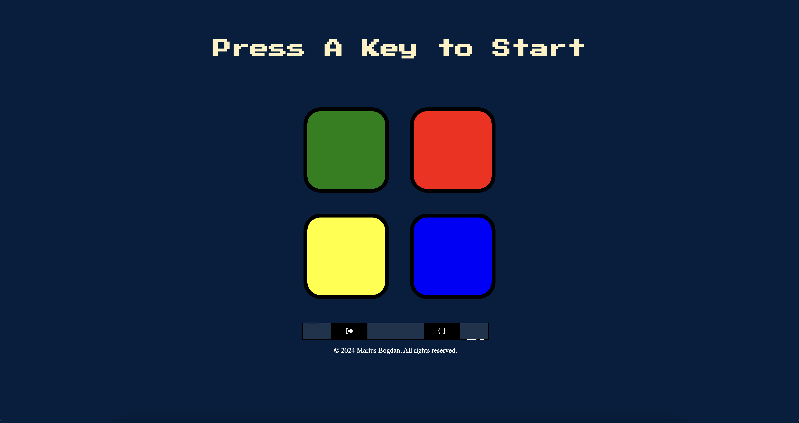

# Simon Game

[](#)
> A fun memory-based game where users must recall and replicate an increasing sequence of colors and sounds.

## Overview

**Simon Game** is an interactive challenge that tests users' memory by requiring them to repeat a sequence of colors and sounds. With each correct input, the difficulty increases, making it an engaging way to improve pattern recognition and memory skills.

## Preview

<p align="center">
  
</p>

## Features

- **Memory Challenge:** Players replicate a growing sequence of colors and sounds.
- **Difficulty Scaling:** Each correct input increases the complexity of the sequence.
- **Interactive UI:** Simple and intuitive design for an engaging experience.

## Live Demo

**Explore the live version here:** [View Live Demo](https://marius-bogdan.com/projects/simon-game/)

## Local Setup

1. **Clone** the repository:
   ```bash
   git clone https://github.com/MIBogdan/simon-game.git
   ```
2. **Open** the `index.html` file in your browser
   *- or use a local development server (like VS Code Live Server) for a smoother development experience.*

---

## Author

**Marius Bogdan**  
[Personal portfolio](https://marius-bogdan.com/)

Feel free to reach out for any questions or collaborations!

## License

This project is provided for testing and demonstration purposes only. All rights are reserved. No part of this project may be redistributed, reuploaded, or used in any manner (commercially or otherwise) without explicit written permission from the author.
